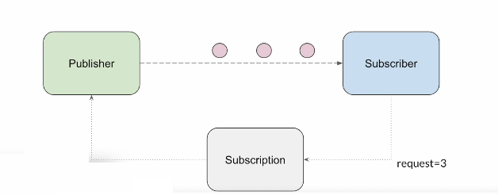

# Reactive Subscriber Publisher

This project demonstrates a simple implementation of the Reactive Streams specification using a subscriber-publisher model.

## Overview

Reactive programming is a programming paradigm oriented around data flows and the propagation of change. This project showcases a basic reactive system where subscribers can subscribe to publishers to receive updates.



## Features

- **Publisher**: Emits data to subscribers.
- **Subscriber**: Receives data from publishers.

## Getting Started

### Prerequisites

-Spring boot

### Installation

Clone the repository:
    ```sh
    git clone https://github.com/yourusername/reactive-subscriber-publisher.git
    ```
## Contributing

Contributions are welcome! Please fork the repository and create a pull request with your changes.

## License

This project is licensed under the MIT License.

## Contact

For any questions or suggestions, please open an issue or contact the repository owner.
